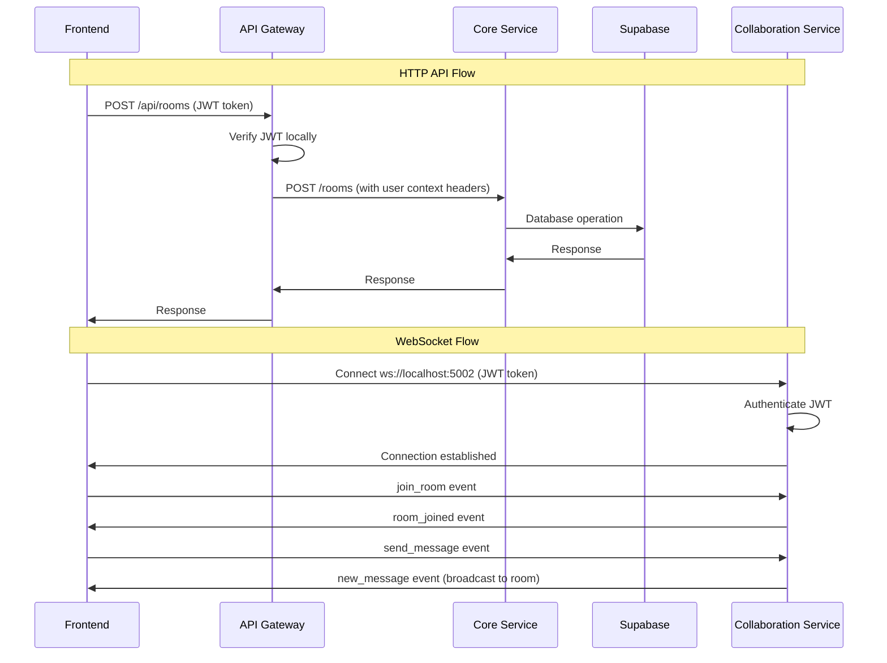

# Ottrpad Backend

A microservices-based backend for the Ottrpad collaborative editor. Built with Node/Express and TypeScript, secured with Supabase JWT, and orchestrated via Turborepo and Docker.

## Architecture overview

```
             ┌───────────────────────────────────────────┐
             │                 Frontend                  │
             │  HTTPS (REST) + WSS (real-time)           │
             └───────────────────────────────────────────┘
                   │             ▲
                   │             │
            REST over HTTPS             │ WebSocket (Socket.IO / Yjs)
                   │             │
        ┌──────────────────────┴─────────────┴──────────────┐
        │                  API Gateway (4000)               │
        │  • Verifies Supabase JWT                          │
        │  • Proxies requests to internal services           │
        │  • Swagger at /api-docs                           │
        └───────────────┬───────────────┬───────────────┬────┘
               │               │               │
              HTTP│           HTTP│           HTTP│
               │               │               │
    ┌──────────────────────────▼───┐  ┌───────▼────────────────────┐  ┌───────────────────────────▼───┐
    │        Core (3001)           │  │        Exe (4004)           │  │        VCS (5000)            │
    │ Rooms, users, workspaces     │  │ Code execution via Docker   │  │ Commits, milestones, timeline │
    │ Supabase Postgres            │  │ Stateful per-room runtimes  │  │ Supabase + local repo data    │
    └──────────────────────────────┘  └─────────────────────────────┘  └───────────────────────────────┘
               ▲
               │
            ┌─────┴─────┐
            │ Collab    │ (5002)
            │ WebSockets│ Presence, chat, Yjs sync
            └───────────┘
```

### Services at a glance

- API Gateway (4000): HTTP entrypoint, CORS, JWT verification, reverse proxy, Swagger docs
- Core (3001): Business logic (rooms, users, workspaces), Supabase access
- Collab (5002): Real-time collaboration (Socket.IO/Yjs), presence, chat
- Exe (4004): Code execution lifecycle (start/exec/stop/status) using Docker
- VCS (5000): Versioning (commits, milestones, grouped timeline)

Ports reflect docker-compose and local dev defaults.

## Running locally

Prereqs: Node 18+, pnpm, Supabase project.

1. Install

```bash
pnpm install
```

2. Configure env

Copy `.env.example` to `.env` and set values (see Env vars). All apps read `../../.env` in dev.

3. Start all services

```bash
pnpm dev
```

Key URLs:

- API: http://localhost:4000
- Swagger: http://localhost:4000/api-docs
- Collab WS: ws://localhost:5002
- Core (internal): http://localhost:3001
- Exe (internal): http://localhost:4004
- VCS (internal): http://localhost:5000

Run single service (example):

```bash
cd apps/api && pnpm dev
```

## Run with Docker

Ensure `.env` contains production-ready values, then:

```bash
docker compose up -d --build
```

Exposed ports:

- 4000 (api), 3001 (core), 5002 (collab), 4004 (exe), 5000 (vcs)

Persistent data:

- `vcs` uses a named volume `vcs-data` (see `docker-compose.yml`).

## Environment variables

Minimum required (used across services — set in `.env`):

```
# Supabase
SUPABASE_URL=...                    # Project URL
SUPABASE_KEY=...                    # Service key or anon key as required
SUPABASE_JWT_SECRET=...             # From Supabase Settings > API

# CORS / Frontend
FRONTEND_URL=http://localhost:3000  # Your frontend origin in dev or prod site URL

# Shared/inter-service auth
GATEWAY_SHARED_SECRET=...           # Used for trusted calls via API Gateway
VERSION_CONTROL_INTERNAL_SECRET=... # VCS <-> Exe internal auth

# Optional
GEMINI_API_KEY=...                  # Used by core/collab if AI features enabled

# Service ports (override only if needed)
API_PORT=4000
CORE_PORT=3001
COLLABORATION_HTTP_PORT=5002
EXE_PORT=4004
VERSION_CONTROL_PORT=5000

# Inter-service URLs (API uses these to proxy)
CORE_SERVICE_URL=http://localhost:3001
COLLABORATION_SERVICE_URL=http://localhost:5002
EXE_SERVICE_URL=http://localhost:4004
VERSION_CONTROL_SERVICE_URL=http://localhost:5000
```

Notes:

- The API Gateway enforces CORS by `FRONTEND_URL` and validates JWTs using `SUPABASE_JWT_SECRET`.
- The Exe service needs Docker access; in Docker it mounts `/var/run/docker.sock`.

## API and features

### API Gateway (4000)

- Verifies Supabase JWT via `verifySupabaseJWT`
- Proxies REST to Core/Exe/VCS using `serviceProxy`
- Swagger at `/api-docs`, health at `/health`

Common routes (examples):

- Workspaces: `GET /api/workspaces`, `GET /api/workspaces/:id`
- Rooms: `POST /api/rooms`, `GET /api/rooms`, `GET/PUT/DELETE /api/rooms/:id`
- Execution: `POST /api/execute/room/:roomId/start|exec|stop`, `GET /api/execute/room/:roomId/status`

### Core (3001)

- Rooms/users/workspaces; Supabase DB; service-level auth for internal calls.

### Collab (5002)

- Socket.IO/Yjs server for presence, chat, code sync; JWT-authenticated connections.

### Exe (4004)

- Manages per-room runtimes with Docker; optional stateful sessions via `EXE_STATEFUL=true`.

### VCS (5000)

- Commits/milestones/timeline grouping (no duplicate commits outside milestones).

## Health and diagnostics

Each service exposes simple health endpoints (subject to change):

- API Gateway: `GET /health`, `GET /health/services`, `GET /health/version`
- Core: `GET /status` (internal)
- Collab: `GET /health`
- Exe: `GET /health`
- VCS: `GET /status`

Use `GET /health/services` on the gateway to see aggregated status and confirm inter-service connectivity.

## Production deployment (outline)

Typical setup is TLS termination at a public reverse proxy (e.g., Nginx) that forwards traffic to the API Gateway and Collab service:

```
# /etc/nginx/conf.d/ottrpad.conf (example)
server {
  listen 443 ssl http2;
  server_name api.ottrpad.dev;

  # ssl_certificate ...
  # ssl_certificate_key ...

  # REST → API Gateway
  location / {
    proxy_pass http://localhost:4000;
    proxy_set_header Host $host;
    proxy_set_header X-Forwarded-Proto $scheme;
    proxy_set_header X-Forwarded-For $proxy_add_x_forwarded_for;
  }

  # WebSockets → Collab (Socket.IO)
  location /socket.io/ {
    proxy_http_version 1.1;
    proxy_set_header Upgrade $http_upgrade;
    proxy_set_header Connection "upgrade";
    proxy_pass http://localhost:5002;
  }
}
```

Notes:

- Frontend should use domain-only URLs (no explicit ports) with TLS: `https://api.ottrpad.dev`, `wss://api.ottrpad.dev`.
- Backend must have `FRONTEND_URL` set to the site origin for CORS.
- Ensure `SUPABASE_JWT_SECRET` matches your Supabase project JWT secret.

## Security model

- Frontdoor JWT: API Gateway validates Supabase JWT for `/api/*` routes.
- Inter-service: shared secrets (`GATEWAY_SHARED_SECRET`, `VERSION_CONTROL_INTERNAL_SECRET`) secure internal traffic.
- CORS: locked to `FRONTEND_URL`.

## Troubleshooting

- 500 from `/api/*`: Check `SUPABASE_JWT_SECRET` is set on API and matches your Supabase project.
- CORS errors: Ensure `FRONTEND_URL` exactly matches your site origin (protocol + host/port).
- SSL issues (prod): Use TLS-terminated domains (no explicit ports) like `https://api.yourdomain` and `wss://api.yourdomain`.
- Exe failures: Docker socket must be available; verify `/var/run/docker.sock` mount and daemon status.

## Repository layout

```
Backend/
├─ apps/
│  ├─ api/     # Gateway (4000)
│  ├─ core/    # Business (3001)
│  ├─ collab/  # Realtime (5002)
│  ├─ exe/     # Execution (4004)
│  └─ vcs/     # Version control (5000)
├─ packages/
│  ├─ logger/
│  └─ supabase/
├─ scripts/
├─ docker-compose.yml
└─ README.md
```

## Contributing

PRs welcome. Please include context, minimal repro steps, and tests where applicable.

- **� OpenAPI Specification**: http://localhost:4000/api-docs.json
- **❤️ Health Dashboard**: http://localhost:4000/health/services

## 🐛 Troubleshooting

### 🔧 Common Issues

#### 🔴 Service Connection Problems

```bash
# Check if all services are running
pnpm dev

# Verify individual service health
curl http://localhost:4000/health  # API Gateway
curl http://localhost:4001/health  # Core Service
curl http://localhost:5002/health  # Collaboration Service

# Check service connectivity
curl http://localhost:4000/health/services  # All services status
```

#### 🔴 JWT Authentication Failures

```bash
# Verify JWT secret is configured
echo $SUPABASE_JWT_SECRET

# Check token format (should start with: eyJhbGciOiJIUzI1NiIs...)
# Ensure token hasn't expired
# Verify token is from the correct Supabase project
```

#### 🔴 WebSocket Connection Issues

```bash
# Test WebSocket endpoint directly
# Browser console: new WebSocket('ws://localhost:5002')

# Check CORS configuration
echo $FRONTEND_URL

# Verify JWT token in WebSocket auth payload
const socket = io('ws://localhost:5002', {
  auth: { token: 'Bearer VALID_JWT_TOKEN' }
});
```

#### 🔴 Database Connection Problems

```bash
# Test Supabase connection
curl "$SUPABASE_URL/rest/v1/" \
  -H "apikey: $SUPABASE_KEY"

# Check environment variables
echo $SUPABASE_URL
echo $SUPABASE_KEY

# Verify database permissions and RLS policies
```

#### 🔴 CORS and Cross-Origin Issues

```bash
# Update frontend URL in environment
FRONTEND_URL=http://localhost:3000

# Restart services after environment changes
pnpm dev

# Check browser developer console for CORS errors
```

### 🛠️ Debug Commands

```bash
# Service health monitoring
curl http://localhost:4000/health/services | jq

# Test authenticated endpoints
curl -H "Authorization: Bearer $JWT_TOKEN" \
     http://localhost:4000/api/rooms | jq

# Test without authentication (should fail with 401)
curl http://localhost:4000/api/rooms

# WebSocket connection test (browser console)
const socket = io('ws://localhost:5002', {
  auth: { token: 'Bearer YOUR_JWT_TOKEN' }
});
socket.on('connect', () => console.log('Connected!'));
socket.on('disconnect', () => console.log('Disconnected!'));

# Monitor service logs
pnpm dev  # Shows logs from all services
```

### 🔍 Service-Specific Debugging

#### API Gateway Issues

- Check `apps/api/src/services/proxy.service.ts` for routing configuration
- Verify JWT middleware in `apps/api/src/middleware/auth.middleware.ts`
- Review Swagger configuration in `apps/api/src/config/swagger.config.ts`

#### Core Service Issues

- Check Supabase client configuration in `apps/core/src/lib/supabaseServer.ts`
- Verify database permissions and RLS policies
- Review controller logic in `apps/core/src/controllers/`

#### Collaboration Service Issues

- Check Socket.IO configuration in `apps/collab/src/services/realtimeCollaborationService.ts`
- Verify WebSocket authentication middleware
- Monitor WebSocket event handlers and room management

## 📊 Service Communication Flow



## License

MIT License - see [LICENSE](LICENSE) file for details.
