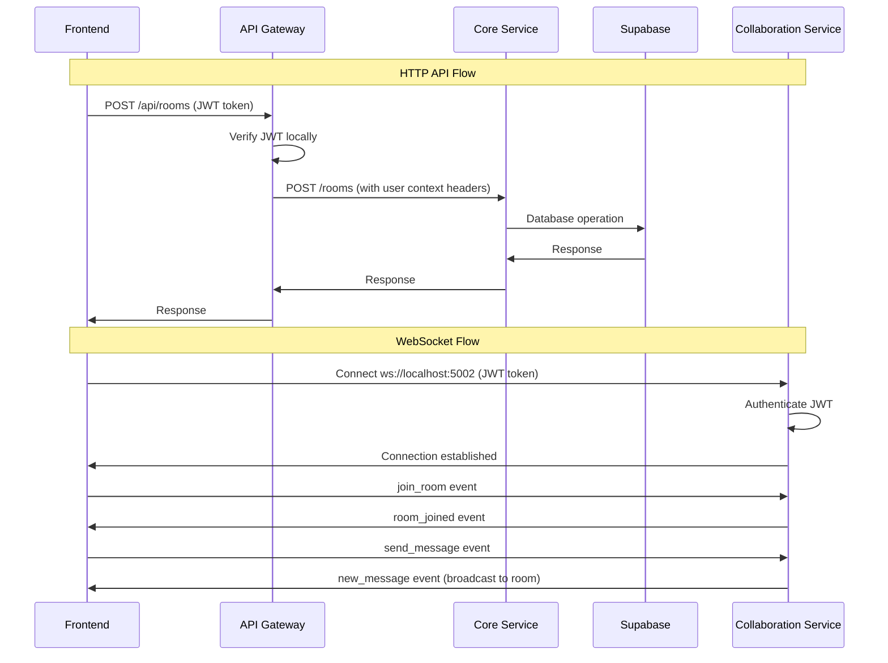

# Realtime Code Editor Backend

A **microservices-based backend** for a collaborative realtime code editor built with Express.js, TypeScript, Socket.IO, and Supabase. The architecture consists of three specialized services that work together to provide a scalable, real-time collaborative coding experience.

## 🏗️ Microservices Architecture

```
Frontend Application
         ↓ (HTTP API Calls)
   API Gateway (Port 4000)
    ↓ (JWT Verification & Routing)
         ↓
    Core Service (Port 4001)
         ↓
    Supabase Database

Frontend WebSocket
         ↓ (Direct Connection)
Collaboration Service (Port 5002)
         ↓ (JWT Authentication)
    Real-time Features
```

### 🎯 Service Overview

| Service                                              | Port | Purpose               | Key Features                                        |
| ---------------------------------------------------- | ---- | --------------------- | --------------------------------------------------- |
| **[API Gateway](./apps/api/README.md)**              | 4000 | HTTP routing & auth   | JWT validation, request proxying, Swagger docs      |
| **[Core Service](./apps/core/README.md)**            | 4001 | Business logic & data | Room management, user profiles, database operations |
| **[Collaboration Service](./apps/collab/README.md)** | 5002 | Real-time features    | WebSocket chat, code sync, presence awareness       |

## ✨ Features

### 🌐 API Gateway

- **🔐 JWT Authentication**: Local verification using Supabase JWT secrets
- **� Request Proxying**: Intelligent routing to microservices
- **📚 Swagger Documentation**: Interactive API explorer at `/api-docs`
- **❤️ Health Monitoring**: System and service health checks
- **🛡️ CORS Protection**: Configurable origin restrictions

### 🏢 Core Service

- **🏠 Room Management**: Create, update, delete, and list collaboration rooms
- **� User Management**: Profile management and user operations
- **🔐 Access Control**: Room permissions and participant validation
- **📊 Data Persistence**: Supabase database operations with RLS
- **🔒 Service Authentication**: Secure inter-service communication

### ⚡ Collaboration Service

- **💬 Real-time Chat**: Instant messaging within rooms via WebSocket
- **📝 Code Synchronization**: Collaborative editing with Yjs CRDT
- **👥 Presence Awareness**: Live cursor tracking and user presence
- **🎯 Event Broadcasting**: Custom real-time event system
- **🔐 Secure WebSockets**: JWT authentication for all connections

### 🔧 Shared Infrastructure

- **📊 Monorepo Management**: Turborepo with pnpm workspaces
- **🎯 TypeScript**: Full type safety across all services
- **🔌 Socket.IO**: High-performance WebSocket communication
- **🗄️ Supabase Integration**: PostgreSQL with real-time subscriptions

## 🚀 Quick Start

### Prerequisites

- Node.js 18+
- pnpm
- Supabase project

### Installation

1. **Clone and install dependencies**

   ```bash
   git clone <repository-url>
   cd backend
   pnpm install
   ```

2. **Configure environment**

   ```bash
   cp .env.example .env
   # Edit .env with your Supabase credentials
   ```

3. **Start development servers**
   ```bash
   pnpm dev
   ```

### Services will be available at:

- 🌐 **API Gateway**: http://localhost:4000
- 📚 **API Documentation**: http://localhost:4000/api-docs
- ❤️ **Health Check**: http://localhost:4000/health
- ⚙️ **Core Service**: http://localhost:4001 (internal)
- 🔌 **Collaboration WebSocket**: ws://localhost:5002
- 💬 **Chat & Real-time**: Connect directly to port 5002

## 🔧 Environment Setup

### Required Environment Variables

```bash
# Supabase Configuration
SUPABASE_URL=your_supabase_project_url
SUPABASE_KEY=your_supabase_anon_key
SUPABASE_JWT_SECRET=your_supabase_jwt_secret

# Service Configuration
API_PORT=4000
CORE_PORT=4001
COLLABORATION_HTTP_PORT=5002

# Service URLs (for inter-service communication)
CORE_SERVICE_URL=http://localhost:4001
FRONTEND_URL=http://localhost:3000

# Development Settings
NODE_ENV=development
```

### 🔑 Getting Supabase JWT Secret

1. Go to your Supabase project dashboard
2. Navigate to **Settings > API**
3. Copy the **"JWT Secret"** value
4. Add it to your `.env` file as `SUPABASE_JWT_SECRET`

## 📡 API Usage

### HTTP API (via API Gateway)

All HTTP API endpoints go through the API Gateway at `http://localhost:4000` and require JWT authentication:

```bash
curl -H "Authorization: Bearer YOUR_JWT_TOKEN" \
     http://localhost:4000/api/rooms
```

### WebSocket API (Direct Connection)

Real-time features connect directly to the Collaboration Service:

```javascript
import { io } from "socket.io-client";

const socket = io("ws://localhost:5002", {
  auth: {
    token: "Bearer YOUR_JWT_TOKEN",
  },
});

// Join a room for real-time collaboration
socket.emit("join_room", { roomId: "your-room-id" });

// Send a chat message
socket.emit("send_message", {
  roomId: "your-room-id",
  message: "Hello everyone!",
});
```

### Available HTTP Endpoints

| Method   | Endpoint                      | Description                | Auth Required | Service |
| -------- | ----------------------------- | -------------------------- | ------------- | ------- |
| `GET`    | `/health`                     | System health check        | ❌            | Gateway |
| `GET`    | `/health/services`            | All services health status | ❌            | Gateway |
| `GET`    | `/api/rooms`                  | List user's rooms          | ✅            | Core    |
| `POST`   | `/api/rooms`                  | Create new room            | ✅            | Core    |
| `GET`    | `/api/rooms/:id`              | Get room details           | ✅            | Core    |
| `PUT`    | `/api/rooms/:id`              | Update room                | ✅            | Core    |
| `DELETE` | `/api/rooms/:id`              | Delete room                | ✅            | Core    |
| `GET`    | `/api/rooms/:id/participants` | Get room participants      | ✅            | Core    |
| `GET`    | `/api/users/profile`          | Get current user profile   | ✅            | Core    |
| `PUT`    | `/api/users/profile`          | Update user profile        | ✅            | Core    |

### WebSocket Events

| Event          | Direction | Description             | Payload                                |
| -------------- | --------- | ----------------------- | -------------------------------------- |
| `join_room`    | C→S       | Join collaboration room | `{ roomId: string }`                   |
| `send_message` | C→S       | Send chat message       | `{ roomId: string, message: string }`  |
| `code_change`  | C→S       | Broadcast code changes  | `{ roomId: string, delta: any }`       |
| `new_message`  | S→C       | Receive chat message    | `{ roomId: string, message: Message }` |
| `user_joined`  | S→C       | User joined room        | `{ roomId: string, user: User }`       |
| `user_left`    | S→C       | User left room          | `{ roomId: string, userId: string }`   |

### 🎮 Interactive Testing

Visit http://localhost:4000/api-docs for **Swagger UI** with built-in authentication and testing capabilities.

## 🏢 Project Structure

```
backend/
├── apps/                          # Microservices
│   ├── api/                       # 🌐 API Gateway (Port 4000)
│   │   ├── src/
│   │   │   ├── middleware/        # JWT authentication
│   │   │   ├── routes/            # HTTP route definitions
│   │   │   ├── services/          # Request proxying logic
│   │   │   └── config/            # Swagger/OpenAPI config
│   │   ├── package.json
│   │   └── README.md              # 📖 API Gateway documentation
│   │
│   ├── core/                      # 🏢 Core Service (Port 4001)
│   │   ├── src/
│   │   │   ├── controllers/       # Business logic handlers
│   │   │   ├── routes/            # HTTP route handlers
│   │   │   ├── services/          # Data and business services
│   │   │   ├── middleware/        # Service authentication
│   │   │   └── lib/               # Supabase client config
│   │   ├── package.json
│   │   └── README.md              # 📖 Core Service documentation
│   │
│   └── collab/                    # ⚡ Collaboration Service (Port 5002)
│       ├── src/
│       │   ├── services/          # Socket.IO and real-time logic
│       │   ├── routes/            # Collaboration HTTP endpoints
│       │   └── middleware/        # WebSocket authentication
│       ├── package.json
│       └── README.md              # 📖 Collaboration Service docs
│
├── packages/                      # Shared packages
│   ├── supabase/                  # 🗄️ Shared Supabase client
│   │   ├── src/index.ts
│   │   ├── package.json
│   │   └── README.md              # 📖 Supabase package docs
│   └── config/                    # Shared configurations
│
├── docs/                          # 📚 Documentation
│   ├── FRONTEND_CHAT_GUIDE.md     # Frontend integration guide
│   ├── FRONTEND_CHAT_MIGRATION.md # Migration instructions
│   └── IMPLEMENTATION.md          # Detailed implementation docs
│
├── package.json                   # Root package configuration
├── pnpm-workspace.yaml           # Workspace configuration
├── turbo.json                    # Turborepo build pipeline
└── README.md                     # 📖 This overview document
```

## 🔐 Security Features

### Multi-Layer Authentication

- **🎫 JWT Authentication**: Local verification using Supabase JWT secrets
- **🔒 Service Isolation**: Inter-service authentication with service tokens
- **🏠 Room-Level Access**: Granular permissions for collaboration rooms
- **🌐 WebSocket Security**: JWT validation for all real-time connections

### Data Protection

- **🛡️ CORS Protection**: Configurable origin restrictions per service
- **🔍 Request Validation**: Input sanitization and validation
- **🚫 Error Handling**: Secure error responses without data leakage
- **🔐 Header Injection**: Secure user context propagation between services

### Database Security

- **🗄️ Row Level Security**: Supabase RLS policies for data isolation
- **🔑 Service Authentication**: Separate credentials for different operations
- **📊 Audit Logging**: Request tracking and user activity monitoring

## 🛠️ Development

### Quick Development Commands

```bash
# 🚀 Start all services in development mode
pnpm dev

# 🔧 Start individual services
pnpm dev:api    # API Gateway only
pnpm dev:core   # Core Service only
pnpm dev:collab # Collaboration Service only

# 🏗️ Build all services
pnpm build

# 🧹 Clean and rebuild
pnpm clean && pnpm build

# 📦 Install dependencies
pnpm install
```

### Service-Specific Development

```bash
# API Gateway (Port 4000)
cd apps/api
pnpm dev          # Hot reload development
pnpm build        # Production build
pnpm start        # Run built version

# Core Service (Port 4001)
cd apps/core
pnpm dev          # Hot reload development
pnpm build        # Production build
pnpm start        # Run built version

# Collaboration Service (Port 5002)
cd apps/collab
pnpm dev          # Hot reload development
pnpm build        # Production build
pnpm start        # Run built version
```

### 🧪 Testing & Debugging

```bash
# 📊 Health check for all services
curl http://localhost:4000/health/services

# 🔐 Test authentication flow
curl -H "Authorization: Bearer JWT_TOKEN" \
     http://localhost:4000/api/rooms

# 💬 Test WebSocket connection
# Use browser console or Socket.IO client
const socket = io('ws://localhost:5002', {
  auth: { token: 'Bearer JWT_TOKEN' }
});

# 📚 Interactive API testing
open http://localhost:4000/api-docs
```

### 🏗️ Adding New Features

#### Adding HTTP Endpoints

1. **Core Service**: Add business logic in `apps/core/src/controllers/`
2. **API Gateway**: Add route in `apps/api/src/routes/gateway.routes.ts`
3. **Documentation**: Update Swagger comments and service READMEs

#### Adding WebSocket Events

1. **Collaboration Service**: Add event handler in `realtimeCollaborationService.ts`
2. **Client Integration**: Update frontend event listeners
3. **Documentation**: Update WebSocket event tables in README

#### Adding New Microservices

1. **Create Service**: New directory in `apps/`
2. **Gateway Integration**: Add routing in API Gateway
3. **Configuration**: Update environment variables and scripts
4. **Documentation**: Create service-specific README

## 📋 Production Deployment

### Docker Support (Coming Soon)

```bash
# Build and run with Docker
docker-compose up -d
```

### Environment Variables for Production

- Set `NODE_ENV=production`
- Configure proper `FRONTEND_URL`
- Use production Supabase credentials
- Set up monitoring and logging
- Configure rate limiting

## 🤝 Contributing

1. Fork the repository
2. Create a feature branch (`git checkout -b feature/amazing-feature`)
3. Make your changes
4. Add tests for new functionality
5. Commit your changes (`git commit -m 'Add amazing feature'`)
6. Push to the branch (`git push origin feature/amazing-feature`)
7. Open a Pull Request

## 📄 Documentation

### � Service Documentation

- **[🌐 API Gateway README](./apps/api/README.md)** - HTTP routing, authentication, and Swagger docs
- **[🏢 Core Service README](./apps/core/README.md)** - Business logic, room management, and database operations
- **[⚡ Collaboration Service README](./apps/collab/README.md)** - WebSocket communication, chat, and real-time features
- **[🗄️ Supabase Package README](./packages/supabase/README.md)** - Shared database client and utilities

### 🔗 Integration Guides

- **[� Frontend Chat Guide](./FRONTEND_CHAT_GUIDE.md)** - Complete frontend integration guide
- **[🔄 Frontend Migration Guide](./FRONTEND_CHAT_MIGRATION.md)** - Migration from monolithic to microservices
- **[🔧 Implementation Details](./IMPLEMENTATION.md)** - Detailed technical implementation

### 🚀 Live Documentation

- **🌐 API Documentation**: http://localhost:4000/api-docs (when running)
- **� OpenAPI Specification**: http://localhost:4000/api-docs.json
- **❤️ Health Dashboard**: http://localhost:4000/health/services

## 🐛 Troubleshooting

### 🔧 Common Issues

#### 🔴 Service Connection Problems

```bash
# Check if all services are running
pnpm dev

# Verify individual service health
curl http://localhost:4000/health  # API Gateway
curl http://localhost:4001/health  # Core Service
curl http://localhost:5002/health  # Collaboration Service

# Check service connectivity
curl http://localhost:4000/health/services  # All services status
```

#### 🔴 JWT Authentication Failures

```bash
# Verify JWT secret is configured
echo $SUPABASE_JWT_SECRET

# Check token format (should start with: eyJhbGciOiJIUzI1NiIs...)
# Ensure token hasn't expired
# Verify token is from the correct Supabase project
```

#### 🔴 WebSocket Connection Issues

```bash
# Test WebSocket endpoint directly
# Browser console: new WebSocket('ws://localhost:5002')

# Check CORS configuration
echo $FRONTEND_URL

# Verify JWT token in WebSocket auth payload
const socket = io('ws://localhost:5002', {
  auth: { token: 'Bearer VALID_JWT_TOKEN' }
});
```

#### 🔴 Database Connection Problems

```bash
# Test Supabase connection
curl "$SUPABASE_URL/rest/v1/" \
  -H "apikey: $SUPABASE_KEY"

# Check environment variables
echo $SUPABASE_URL
echo $SUPABASE_KEY

# Verify database permissions and RLS policies
```

#### 🔴 CORS and Cross-Origin Issues

```bash
# Update frontend URL in environment
FRONTEND_URL=http://localhost:3000

# Restart services after environment changes
pnpm dev

# Check browser developer console for CORS errors
```

### 🛠️ Debug Commands

```bash
# Service health monitoring
curl http://localhost:4000/health/services | jq

# Test authenticated endpoints
curl -H "Authorization: Bearer $JWT_TOKEN" \
     http://localhost:4000/api/rooms | jq

# Test without authentication (should fail with 401)
curl http://localhost:4000/api/rooms

# WebSocket connection test (browser console)
const socket = io('ws://localhost:5002', {
  auth: { token: 'Bearer YOUR_JWT_TOKEN' }
});
socket.on('connect', () => console.log('Connected!'));
socket.on('disconnect', () => console.log('Disconnected!'));

# Monitor service logs
pnpm dev  # Shows logs from all services
```

### 🔍 Service-Specific Debugging

#### API Gateway Issues

- Check `apps/api/src/services/proxy.service.ts` for routing configuration
- Verify JWT middleware in `apps/api/src/middleware/auth.middleware.ts`
- Review Swagger configuration in `apps/api/src/config/swagger.config.ts`

#### Core Service Issues

- Check Supabase client configuration in `apps/core/src/lib/supabaseServer.ts`
- Verify database permissions and RLS policies
- Review controller logic in `apps/core/src/controllers/`

#### Collaboration Service Issues

- Check Socket.IO configuration in `apps/collab/src/services/realtimeCollaborationService.ts`
- Verify WebSocket authentication middleware
- Monitor WebSocket event handlers and room management

## 📈 Roadmap

### ✅ Phase 1 - Core Infrastructure (Completed)

- [x] **Microservices Architecture**: API Gateway, Core Service, Collaboration Service
- [x] **JWT Authentication Layer**: Supabase integration with local verification
- [x] **Real-time Communication**: Socket.IO with room-based messaging
- [x] **API Documentation**: Swagger UI with interactive testing
- [x] **Health Monitoring**: Service health checks and status endpoints
- [x] **Room Management**: Full CRUD operations for collaboration rooms

### 🚧 Phase 2 - Enhanced Collaboration (In Progress)

- [ ] **Persistent Chat History**: Database storage for message history
- [ ] **Advanced Code Sync**: Enhanced Yjs integration with conflict resolution
- [ ] **File Sharing**: Collaborative file uploads and management
- [ ] **Presence Indicators**: Advanced user presence and cursor tracking
- [ ] **Permission System**: Granular room permissions (read, write, admin)
- [ ] **Rate Limiting**: Request throttling and abuse prevention

### 🔮 Phase 3 - Scalability & Performance (Planned)

- [ ] **Redis Integration**: Session management and multi-instance scaling
- [ ] **Message Queues**: Event processing optimization with Bull/BullMQ
- [ ] **Database Clustering**: Read replicas and connection optimization
- [ ] **CDN Integration**: Global WebSocket endpoints for low latency
- [ ] **Performance Monitoring**: Metrics collection and alerting
- [ ] **Load Balancing**: Horizontal scaling for high availability

### 🚀 Phase 4 - Advanced Features (Future)

- [ ] **Video/Audio Chat**: WebRTC integration for voice/video calls
- [ ] **Screen Sharing**: Real-time screen sharing within rooms
- [ ] **Plugin System**: Extensible architecture for custom features
- [ ] **Analytics Dashboard**: Usage analytics and collaboration insights
- [ ] **Mobile API**: Optimized endpoints for mobile applications
- [ ] **AI Integration**: Code suggestions and collaborative AI features

## 🏆 Tech Stack

### Core Technologies

- **🌐 Backend Framework**: Express.js with TypeScript
- **🗄️ Database**: Supabase (PostgreSQL) with Row Level Security
- **🔐 Authentication**: Supabase Auth with Google OAuth
- **⚡ Real-time**: Socket.IO for WebSocket communication
- **📝 Code Collaboration**: Yjs CRDT for conflict-free editing

### Infrastructure

- **📦 Monorepo**: Turborepo + pnpm workspaces
- **🔧 Build System**: TypeScript compilation with hot reloading
- **📚 Documentation**: Swagger/OpenAPI 3.0 with interactive UI
- **🏗️ Architecture**: Microservices with API Gateway pattern
- **🌍 Runtime**: Node.js 18+ with ESM support

### Development Tools

- **🔄 Process Management**: Nodemon for development hot reloading
- **🎯 Type Safety**: Full TypeScript coverage across all services
- **📊 Environment Management**: dotenv for configuration
- **🧪 API Testing**: Built-in Swagger UI for interactive testing

## 📊 Service Communication Flow



### 🔄 Request Flow Patterns

#### HTTP API Requests

1. **Frontend** → **API Gateway** (JWT in Authorization header)
2. **API Gateway** → JWT validation → User context extraction
3. **API Gateway** → **Core Service** (User context in headers)
4. **Core Service** → **Supabase** (Database operations)
5. **Response** flows back through the chain

#### WebSocket Real-time Communication

1. **Frontend** → **Collaboration Service** (Direct WebSocket connection)
2. **Collaboration Service** → JWT validation on connection
3. **Real-time events** → Authenticated users in specific rooms
4. **Broadcasting** → All participants in the same room

### 🏗️ Architecture Benefits

- **🚀 Performance**: Direct WebSocket connections bypass API Gateway overhead
- **🔒 Security**: JWT validation at every entry point
- **📈 Scalability**: Services can be scaled independently
- **🔧 Maintainability**: Clear separation of concerns
- **🔍 Debugging**: Service-specific logs and health endpoints

## 📜 License

MIT License - see [LICENSE](LICENSE) file for details.

## 🙋‍♂️ Support

- 📧 Email: support@ottrpad.com
- 💬 Discord: [Join our community](https://discord.gg/ottrpad)
- 📖 Documentation: [Full docs](./IMPLEMENTATION.md)
- 🐛 Issues: [GitHub Issues](https://github.com/OttrPad/Backend/issues)

---

**Built with ❤️ for collaborative coding**

_Made by the OttrPad team - Empowering developers to code together, anywhere._
