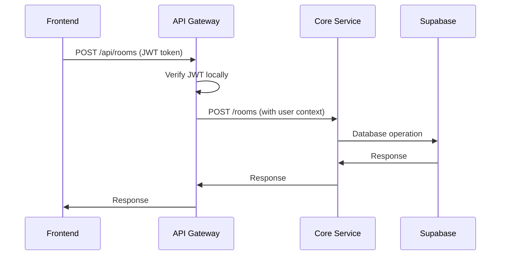

# Realtime Code Editor Backend

A microservices-based backend for a collaborative realtime code editor built with Express.js, TypeScript, and Supabase.

## 🏗️ Architecture

```
Frontend (React/Next.js)
         ↓
   API Gateway (Port 4000)
    ↓ (JWT Verification)
         ↓
    Core Service (Port 4001)
         ↓
    Supabase Database
```

## ✨ Features

- **🔐 JWT Authentication**: Local verification using Supabase JWT secrets
- **🚀 API Gateway**: Centralized routing and authentication
- **🔄 Service Proxy**: Intelligent request forwarding to microservices
- **📚 Swagger UI**: Interactive API documentation
- **❤️ Health Monitoring**: Real-time service health checks
- **🛡️ CORS Protection**: Configurable origin restrictions
- **📊 Monorepo**: Managed with Turborepo and pnpm

## 🚀 Quick Start

### Prerequisites

- Node.js 18+
- pnpm
- Supabase project

### Installation

1. **Clone and install dependencies**

   ```bash
   git clone <repository-url>
   cd backend
   pnpm install
   ```

2. **Configure environment**

   ```bash
   cp .env.example .env
   # Edit .env with your Supabase credentials
   ```

3. **Start development servers**
   ```bash
   pnpm dev
   ```

### Services will be available at:

- 🌐 **API Gateway**: http://localhost:4000
- 📚 **API Documentation**: http://localhost:4000/api-docs
- ❤️ **Health Check**: http://localhost:4000/health
- ⚙️ **Core Service**: http://localhost:4001

## 🔧 Environment Setup

### Required Environment Variables

```bash
# Supabase Configuration
SUPABASE_URL=your_supabase_project_url
SUPABASE_KEY=your_supabase_anon_key
SUPABASE_JWT_SECRET=your_supabase_jwt_secret

# Service URLs
CORE_SERVICE_URL=http://localhost:4001
FRONTEND_URL=http://localhost:3000

# API Configuration
PORT=4000
NODE_ENV=development
```

### 🔑 Getting Supabase JWT Secret

1. Go to your Supabase project dashboard
2. Navigate to **Settings > API**
3. Copy the **"JWT Secret"** value
4. Add it to your `.env` file as `SUPABASE_JWT_SECRET`

## 📡 API Usage

### Authentication

All API endpoints require a valid Supabase JWT token:

```bash
curl -H "Authorization: Bearer YOUR_JWT_TOKEN" \
     http://localhost:4000/api/rooms
```

### Available Endpoints

| Method   | Endpoint           | Description                 | Auth Required |
| -------- | ------------------ | --------------------------- | ------------- |
| `GET`    | `/health`          | System health check         | ❌            |
| `GET`    | `/health/services` | Microservices health status | ❌            |
| `GET`    | `/api/rooms`       | List rooms                  | ✅            |
| `POST`   | `/api/rooms`       | Create room                 | ✅            |
| `PUT`    | `/api/rooms/:id`   | Update room                 | ✅            |
| `DELETE` | `/api/rooms/:id`   | Delete room                 | ✅            |

### 🎮 Interactive Testing

Visit http://localhost:4000/api-docs for **Swagger UI** with built-in authentication and testing capabilities.

## 🏢 Project Structure

```
backend/
├── apps/
│   ├── api/                    # API Gateway
│   │   ├── src/
│   │   │   ├── middleware/     # Auth middleware
│   │   │   ├── routes/         # Route definitions
│   │   │   ├── services/       # Proxy service
│   │   │   └── config/         # Swagger configuration
│   │   └── package.json
│   └── core/                   # Core microservice
│       ├── src/
│       │   ├── controllers/    # Business logic
│       │   ├── routes/         # Route handlers
│       │   └── services/       # Data services
│       └── package.json
├── packages/
│   ├── supabase/              # Shared Supabase client
│   └── config/                # Shared configurations
├── package.json               # Root package.json
├── pnpm-workspace.yaml       # Workspace configuration
├── turbo.json                # Turborepo configuration
└── IMPLEMENTATION.md          # Detailed implementation docs
```

## 🔐 Security Features

- **JWT Authentication**: Local verification using Supabase JWT secrets
- **CORS Protection**: Configurable origin restrictions
- **Request Validation**: Input sanitization and validation
- **Error Handling**: Secure error responses without data leakage
- **Service Isolation**: Microservice architecture with API gateway
- **Header Injection**: User context automatically added to service requests

## 🛠️ Development

### Adding New Microservices

1. Create new app in `apps/` directory
2. Add service configuration to `apps/api/src/services/proxy.service.ts`
3. Create routes in `apps/api/src/routes/`
4. Update Swagger documentation

### Testing

```bash
# Run all services in development mode
pnpm dev

# Check health of all services
curl http://localhost:4000/health/services

# Test with interactive Swagger UI
open http://localhost:4000/api-docs
```

### Scripts

```bash
# Development
pnpm dev          # Start all services in watch mode
pnpm build        # Build all services for production
pnpm lint         # Run linting across all packages

# Individual services
cd apps/api && pnpm dev    # Run only API Gateway
cd apps/core && pnpm dev   # Run only Core Service
```

## 📋 Production Deployment

### Docker Support (Coming Soon)

```bash
# Build and run with Docker
docker-compose up -d
```

### Environment Variables for Production

- Set `NODE_ENV=production`
- Configure proper `FRONTEND_URL`
- Use production Supabase credentials
- Set up monitoring and logging
- Configure rate limiting

## 🤝 Contributing

1. Fork the repository
2. Create a feature branch (`git checkout -b feature/amazing-feature`)
3. Make your changes
4. Add tests for new functionality
5. Commit your changes (`git commit -m 'Add amazing feature'`)
6. Push to the branch (`git push origin feature/amazing-feature`)
7. Open a Pull Request

## 📄 Documentation

- **🔗 API Documentation**: http://localhost:4000/api-docs (when running)
- **📝 Implementation Details**: [IMPLEMENTATION.md](./IMPLEMENTATION.md)
- **🔧 OpenAPI Spec**: http://localhost:4000/api-docs.json

## 🐛 Troubleshooting

### Common Issues

**🔴 JWT Verification Fails**

```bash
# Check if JWT secret is set
echo $SUPABASE_JWT_SECRET

# Verify token format and expiration
# Token should start with: eyJhbGciOiJIUzI1NiIs...
```

**🔴 Service Unavailable Errors**

```bash
# Ensure all services are running
pnpm dev

# Check individual service health
curl http://localhost:4000/health/services
curl http://localhost:4001/status
```

**🔴 CORS Errors**

```bash
# Update FRONTEND_URL in .env
FRONTEND_URL=http://localhost:3000

# Verify CORS configuration in API gateway
```

### Debug Commands

```bash
# Check service health
curl http://localhost:4000/health/services

# View service logs
pnpm dev

# Test JWT verification
curl -H "Authorization: Bearer YOUR_TOKEN" \
     http://localhost:4000/api/rooms

# Test without authentication (should fail)
curl http://localhost:4000/api/rooms
```

## 📈 Roadmap

### Phase 1 - Current ✅

- [x] JWT Authentication Layer
- [x] API Gateway with Service Proxy
- [x] Swagger UI Documentation
- [x] Health Monitoring
- [x] Room Management API

### Phase 2 - Next Up 🚧

- [ ] WebSocket support for real-time collaboration
- [ ] Rate limiting and request throttling
- [ ] Advanced logging and monitoring
- [ ] Database migrations management
- [ ] Comprehensive test suite

### Phase 3 - Future 🔮

- [ ] Docker containerization
- [ ] CI/CD pipeline
- [ ] Service mesh integration
- [ ] Advanced analytics
- [ ] Performance monitoring

## 🏆 Tech Stack

- **Backend Framework**: Express.js
- **Language**: TypeScript
- **Database**: Supabase (PostgreSQL)
- **Authentication**: Supabase Auth (Google OAuth)
- **Monorepo**: Turborepo + pnpm
- **Documentation**: Swagger/OpenAPI 3.0
- **Runtime**: Node.js 18+

## 📊 API Flow



## 📜 License

MIT License - see [LICENSE](LICENSE) file for details.

## 🙋‍♂️ Support

- 📧 Email: support@ottrpad.com
- 💬 Discord: [Join our community](https://discord.gg/ottrpad)
- 📖 Documentation: [Full docs](./IMPLEMENTATION.md)
- 🐛 Issues: [GitHub Issues](https://github.com/OttrPad/Backend/issues)

---

**Built with ❤️ for collaborative coding**

_Made by the OttrPad team - Empowering developers to code together, anywhere._
